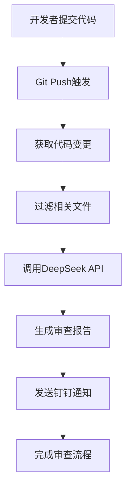

# 🤖 AI Code Review 工具

一个基于DeepSeek API的智能代码审查工具，可以自动分析代码变更并通过钉钉推送审查结果。

## ✨ 功能特性

- 🔍 **智能代码分析**: 使用DeepSeek AI分析代码质量、潜在bug、性能优化等
- 📱 **钉钉集成**: 自动将审查结果推送到指定钉钉群组
- 🔄 **Git集成**: 支持Git hooks自动触发或手动执行
- ⚙️ **高度可配置**: 支持自定义文件过滤、审查规则等
- 🎯 **多语言支持**: 支持JavaScript、Python、Java、Go等多种编程语言

## 🚀 快速开始

### 1. 安装工具

```bash
# 下载安装脚本并执行
chmod +x install.sh
./install.sh
```

### 2. 配置参数

编辑 `.ai-code-review/config.json` 文件:

```json
{
  "deepseek": {
    "apiKey": "your-deepseek-api-key-here",
    "baseURL": "https://api.deepseek.com/v1",
    "model": "deepseek-coder",
    "maxTokens": 2000,
    "temperature": 0.1
  },
  "dingtalk": {
    "webhook": "your-dingtalk-webhook-url",
    "secret": "your-dingtalk-secret"
  },
  "project": {
    "name": "你的项目名称",
    "frontendGroup": "前端开发群",
    "backendGroup": "后端开发群"
  }
}
```

### 3. 获取API密钥

#### DeepSeek API Key
1. 访问 [DeepSeek 开放平台](https://platform.deepseek.com/)
2. 注册并登录账号
3. 创建API Key并复制到配置文件中

#### 钉钉机器人配置
1. 在钉钉群中添加自定义机器人
2. 选择"加签"安全设置
3. 复制Webhook地址和Secret到配置文件

## 📖 使用方法

### 自动触发（推荐）

工具会在 `git push` 时自动执行代码审查:

```bash
git add .
git commit -m "feat: 添加新功能"
git push  # 自动触发AI代码审查
```

### 手动执行

```bash
# 审查最近一次提交
./review-code.sh

# 审查最近3次提交
./review-code.sh HEAD~3

# 审查与main分支的差异
./review-code.sh main

# 审查特定提交范围
./review-code.sh commit1..commit2
```

## ⚙️ 高级配置

### 文件过滤规则

在 `config.json` 中配置需要审查的文件类型:

```json
{
  "codeReview": {
    "includeFiles": [
      "*.js", "*.ts", "*.jsx", "*.tsx",
      "*.py", "*.java", "*.go", "*.cpp", "*.c"
    ],
    "excludeFiles": [
      "node_modules/**",
      "dist/**", "build/**",
      "*.min.js", "*.test.js",
      "coverage/**"
    ],
    "maxDiffLines": 500
  }
}
```

### 审查维度定制

```json
{
  "codeReview": {
    "reviewAspects": [
      "代码规范性",
      "潜在bug", 
      "性能优化",
      "安全问题",
      "可维护性",
      "最佳实践",
      "测试覆盖"
    ]
  }
}
```

### CI/CD 集成

#### GitHub Actions

创建 `.github/workflows/code-review.yml`:

```yaml
name: AI Code Review

on:
  pull_request:
    branches: [ main, develop ]

jobs:
  code-review:
    runs-on: ubuntu-latest
    steps:
    - uses: actions/checkout@v3
      with:
        fetch-depth: 0
        
    - name: Setup Node.js
      uses: actions/setup-node@v3
      with:
        node-version: '18'
        
    - name: Install dependencies
      run: npm install
      
    - name: Run AI Code Review
      run: node .ai-code-review/ai-code-review.js origin/main
      env:
        DEEPSEEK_API_KEY: ${{ secrets.DEEPSEEK_API_KEY }}
```

#### GitLab CI

创建 `.gitlab-ci.yml`:

```yaml
ai-code-review:
  stage: test
  image: node:18
  script:
    - npm install
    - node .ai-code-review/ai-code-review.js origin/main
  only:
    - merge_requests
  variables:
    DEEPSEEK_API_KEY: $DEEPSEEK_API_KEY
```

## 🛠️ 故障排除

### 常见问题

1. **API调用失败**
   ```bash
   # 检查API Key是否正确
   curl -H "Authorization: Bearer your-api-key" https://api.deepseek.com/v1/models
   ```

2. **钉钉消息发送失败**
   - 检查Webhook地址是否正确
   - 确认机器人安全设置（加签Secret）
   - 验证消息格式是否符合钉钉要求

3. **Git hooks不执行**
   ```bash
   # 检查hooks权限
   ls -la .git/hooks/pre-push
   
   # 重新设置执行权限
   chmod +x .git/hooks/pre-push
   ```

### 调试模式

开启详细日志:

```bash
DEBUG=1 ./review-code.sh
```

### 性能优化

- 调整 `maxDiffLines` 限制审查的代码行数
- 优化 `includeFiles` 和 `excludeFiles` 规则
- 适当调整API的 `maxTokens` 参数

## 🔄 工作流程



## 📊 输出示例

AI审查报告包含以下内容:

```markdown
## 📋 代码审查总结
- 变更文件数: 3个
- 主要变更类型: 新增功能

## 🔍 详细分析

### ✅ 优点
- 代码结构清晰，模块化设计良好
- 变量命名规范，易于理解
- 添加了适当的错误处理

### ⚠️ 需要注意的问题
- line 45: 建议添加参数校验
- line 78: 可能存在内存泄漏风险
- line 92: 缺少异常捕获处理

### 💡 优化建议  
- 建议使用async/await替代Promise.then()
- 考虑添加单元测试覆盖新增功能
- 可以抽取公共方法减少代码重复

## 📊 评分
代码质量评分: 8/10 分
```

## 🤝 贡献指南

欢迎提交Issue和Pull Request来改进这个工具！

## 📄 许可证

MIT License

## 🆘 支持

如果遇到问题，请:
1. 查看故障排除部分
2. 搜索已有的Issues
3. 创建新的Issue描述问题

---

**Happy Coding! 🎉** 